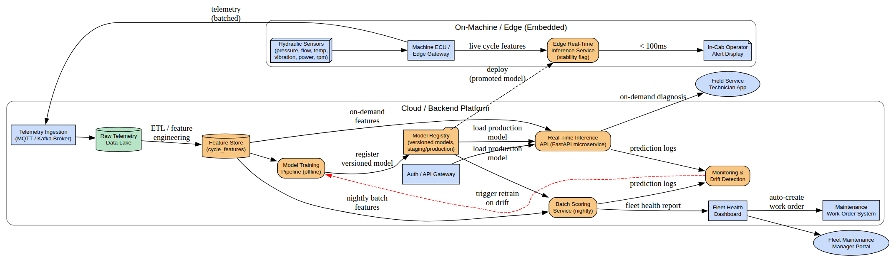
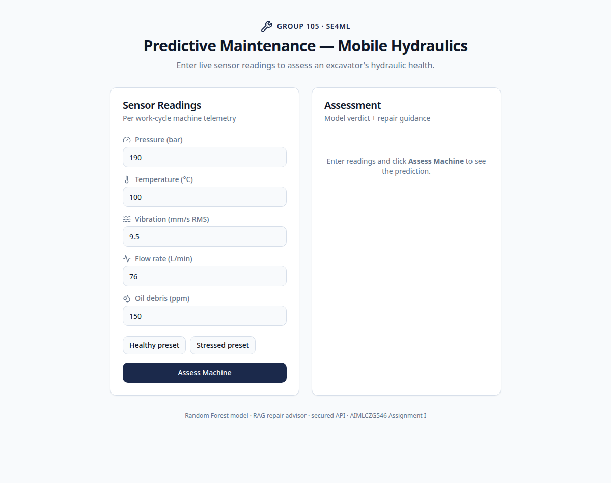
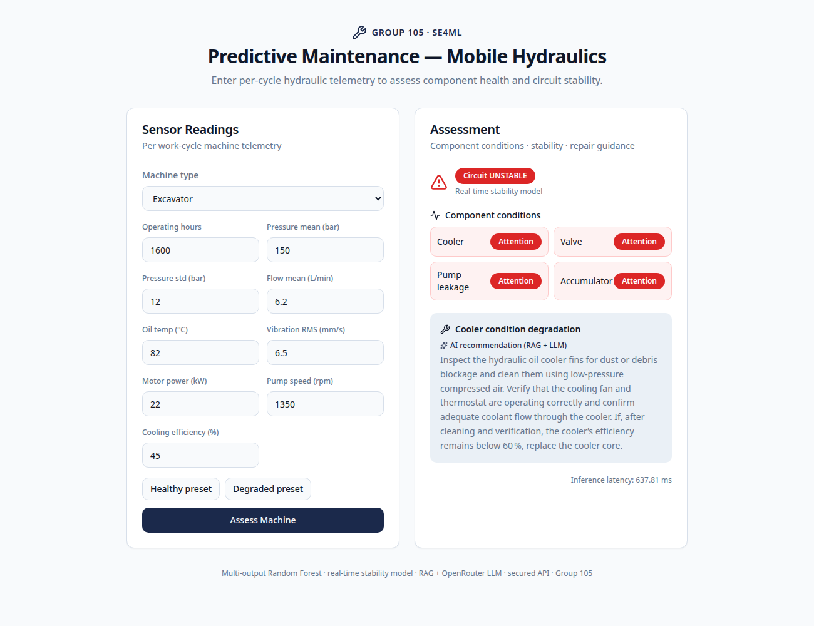

# BITS Pilani — Work Integrated Learning Programmes

## M.Tech. Artificial Intelligence & Machine Learning

**Course:** AIMLCZG546 — Software Engineering for Machine Learning

# Assignment II

**Work Title:** *Predictive Maintenance in Mobile Hydraulic Systems*

**GitHub repository:** heavy-machinery-predictive-maintenance-pipeline

## Group No. 105

### Group Member Names with Contribution

| Sl. No | BITS ID | Name | Contribution of team member (Qualitative) | Percentage Contribution (Out of 100) |
|---|---|---|---|---|
| 1 | 2024AC05744 | Srinivasan R | Code refactoring into OOP modules (`src/core`, `src/api`), DRY consolidation of the training pipeline, Model Registry design, architectural patterns, code review and system integration. | 100% |
| 2 | 2024AC05100 | Vineet Kumar | Docker-based deployment of API + frontend, CI pipeline (lint gates → train → test), linting/formatting toolchain (black, isort, flake8), training profiling and performance instrumentation. | 100% |
| 3 | 2024AD05482 | Vibhav Sharma | Data-quality metrics module (schema validation, missing-value checks, PSI drift detection), validation-dataset criteria, production testing strategy, review feedback and report preparation. | 100% |
| 4 | 2024AC05064 | Aman Kushwah | Model training/evaluation, FastAPI REST API incl. batch endpoint, security layer, the classified pytest suite (49 tests: unit, integration, ML, data, RAG, idempotency, performance), documentation. | 100% |

\newpage

# 1. Introduction — the story of one sensor reading

Our system answers a single practical question for a fleet operator: **"which of
my machines needs maintenance, on which component, and what should the
technician do about it?"**

Picture an excavator in the field. Every operating cycle, its sensors report
pressure, flow, oil temperature, vibration, motor power, pump speed and cooling
efficiency. That reading takes the following journey through our system —
and this report follows the same journey, because every assignment requirement
maps to one station on it:

1. **Data quality gate** — is the reading schema-valid, complete, and drawn
   from the same distribution the model was trained on? (`src/quality`,
   Section 3.3)
2. **Security gate** — is the caller authenticated, within rate limits, and is
   the reading physically plausible? (`src/security`, Sections 2.3 / 3.4)
3. **Inference** — two trained models predict component health (cooler, valve,
   pump, accumulator) and an overall stability flag (`src/ml`, `src/api`,
   Sections 2.1 / 2.5)
4. **Advice** — a RAG advisor retrieves the matching repair procedure from the
   maintenance manual (`src/rag`)
5. **Response** — a typed JSON answer returns to the React dashboard, with
   latency reported and the event recorded in a tamper-evident audit trail.



Everything in this report is verifiable from the repository: the code, a
**49-test classified pytest suite**, lint reports, profiling output and
measured metrics (`tests/metrics_report.json`) are all committed as evidence.

**Repository layout (production package):**

```
├── api_server.py            # thin uvicorn entry point -> src/api/server.py
├── train_and_save.py        # thin CLI wrapper -> src/ml/train.py (DRY)
├── src/
│   ├── api/server.py        # FastAPI REST API (single + batch endpoints)
│   ├── core/model_registry.py  # on-disk model registry w/ SHA-256 integrity
│   ├── ml/train.py          # canonical training pipeline (profiled, idempotent)
│   ├── quality/data_quality.py # schema / missing-value / drift metrics
│   ├── rag/maintenance_advisor.py # TF-IDF retriever + advisor
│   └── security/security_layer.py # auth, validation, rate limit, audit
├── tests/                   # 49 tests in 8 marker-classified suites + conftest
├── notebook/105.ipynb       # research notebook (prototype)
├── data/hydraulic_fleet_telemetry.csv   # 10,000 cycles, 5 machine types
├── docs/lint/               # before/after lint + pytest reports
└── docker-compose.yml, Dockerfile, frontend/, .github/workflows/
```

\newpage

# 2. Objective 1 — Implementation and Code Sharing

## 2.1 Task 1 — Refactoring with OOP / functional principles

The application is decomposed into single-responsibility modules under `src/`.
Below, **each design pattern is shown with its actual code** and the reasoning
for choosing it.

### (a) Pipe-and-Filter — `src/ml/train.py`

Preprocessing and the classifier are composed as one sklearn `Pipeline`, so the
**exact same transformation** learned at training time is replayed at inference
time — eliminating training/serving skew, the most common production-ML bug.

```python
def build_stability_model() -> Pipeline:
    return Pipeline([
        ("prep", build_preprocessor()),          # filter 1: scale + one-hot encode
        ("clf", RandomForestClassifier(          # filter 2: classify
            n_estimators=60, max_depth=6, random_state=42, n_jobs=-1)),
    ])
```

The builder functions (`build_preprocessor`, `build_condition_model`,
`build_stability_model`) are **pure functions** — no global state — which is
what lets the idempotency tests retrain the same model twice and compare
outputs byte-for-byte.

### (b) Model Registry — `src/core/model_registry.py`

Trained artifacts are opaque binaries; without bookkeeping you cannot tell if
the file being served is the file you trained. The registry maps each artifact
to its SHA-256 in `model_registry/index.json`; the API refuses to start on a
mismatch.

```python
@dataclass
class ModelArtifact:            # immutable value object
    path: str
    sha256: str
    metadata: dict[str, Any]

class ModelRegistry:            # single responsibility: the index, nothing else
    def register(self, artifact: ModelArtifact) -> None: ...
    def get(self, path: str) -> ModelArtifact | None: ...
```

### (c) Facade — `src/security_layer.py` (and `SecureInferenceGateway`)

Callers import one stable path (`src.security_layer`) while the implementation
lives in `src/security/security_layer.py`. The `SecureInferenceGateway` class
is a second facade: it composes `ApiKeyAuthenticator` + `RateLimiter` +
`AuditTrail` + input validation behind a single `guarded_predict()` call, so
the API endpoint stays readable. These top-level one-line modules are **not
dead "dummy files"** — they are deliberate stable-import facades, now
documented as such in their docstrings.

### (d) Strategy-style retriever — `src/rag/maintenance_advisor.py`

`TfidfRetriever` mirrors a vector-DB collection interface (`add`/`retrieve`),
so it can be swapped for ChromaDB or an embedding model without touching the
advisor. Documents are immutable `@dataclass` value objects.

### (e) DTOs / typed contracts — `src/api/server.py`

Pydantic models (`SensorReading`, `PredictionResponse`, `BatchPredictionRequest`)
are the API's data-transfer objects: every request is validated and every
response serialized against an explicit schema, which is also what powers the
auto-generated Swagger docs.

### DRY & SOLID (review feedback applied)

* **DRY:** the training logic previously existed twice (`train_and_save.py`
  and `src/ml/train.py`). It is now consolidated: `src/ml/train.py` is the
  single canonical implementation; `train_and_save.py` is a 20-line CLI
  wrapper kept only because Docker, DVC and CI invoke that path. The API's
  per-component severity resolution was likewise extracted into one
  `_resolve_components()` helper shared by the single and batch endpoints.
* **Single Responsibility:** each module owns exactly one concern (train,
  registry, security, quality, retrieval, serving).
* **Open/Closed & Liskov:** the retriever and gateway expose small interfaces
  that alternative implementations can satisfy without modifying callers.
* **Dependency Inversion:** the API depends on the registry/security
  *abstractions* re-exported by the facades, not on concrete file paths.

### Scalability (review feedback applied)

The service is **stateless** — models are read-only after startup, no session
state — so it scales *horizontally* behind any load balancer (multiple
`uvicorn` workers or container replicas). For *vertical* throughput, the new
`POST /predict/batch` endpoint accepts up to 1,000 readings and performs **one
vectorized sklearn call** for the whole batch. Measured effect (Section 3.3):
a single-reading call costs ~42 ms median, while a batched reading costs
**0.26 ms** — a ~160× amortization — without any cloud infrastructure.

## 2.2 Task 2 — Research code vs production code

We contrast the **model-training component**, which exists in both forms.
Each row includes the reasoning why the difference matters.

| Aspect | Research — `notebook/105.ipynb` | Production — `src/ml/train.py` | Why this matters |
|---|---|---|---|
| Purpose | Exploration: EDA, feature experiments, model comparison | Repeatable artifact production for the API | Research optimizes for iteration speed; production optimizes for reliability. Mixing the two goals in one artifact serves neither. |
| Structure | Linear cells, global state, inline plots | Pure builder functions + `main(force, profile)` | Cells depend on execution order — re-running out of order silently changes results. Functions with explicit inputs cannot. |
| Reproducibility | Depends on cell execution order and kernel state | Deterministic script; DVC stage pins data + code deps; idempotency guard skips redundant retrains | A colleague (or CI) must get the same model from the same commit — this is tested (`pytest -m idempotency`). |
| Error handling | None — exceptions surface in the cell | Typed exceptions with logging (Section 2.3) | A notebook has a human watching; a pipeline runs unattended and must fail loudly and diagnosably. |
| Outputs | Transient (in-memory, plots) | Versioned artifacts + SHA-256 checksums + `schema.json` contract | The API must never guess feature order or class labels — it reads the contract the trainer wrote. |
| Testing | Manual visual inspection | 49 automated tests, lint-clean, enforced by CI | Human inspection does not scale and cannot run on every pull request. |
| Profiling | `%%time` ad hoc | Every stage timed, peak memory tracked, optional cProfile report | Production budgets (retrain windows, memory limits) need numbers, not impressions. |
| Interface | A human reading the notebook | The FastAPI service and CI consume the artifacts | Production code's "user" is another program — hence typed contracts. |

The notebook remains the *system of record for experiments*; `src/` is the
*system of record for behaviour*.

## 2.3 Task 3 — Error handling and logging

### Which exceptions, where, and why

| Exception | Raised in | Condition | Handled by |
|---|---|---|---|
| `SecurityError` (custom) | `src/security/security_layer.py` | bad API key, rate-limit exceeded, missing/NaN/out-of-range sensor value | API converts to **HTTP 400** with a clear detail message |
| `DataQualityError` (custom) | `src/quality/data_quality.py` | schema violation (strict mode), fully-missing column, empty PSI sample | training/monitoring pipelines fail fast instead of learning from bad data |
| `FileNotFoundError` (built-in) | `src/ml/train.py` | dataset CSV absent | surfaces immediately with the expected path in the message |
| `RuntimeError` (built-in) | `src/api/server.py` startup | artifacts missing, registry SHA mismatch, artifact load failure | the service **refuses to start** rather than serve a wrong/tampered model |
| `HTTPException` (FastAPI) | `src/api/server.py` endpoints | any `SecurityError` at request time | returned as status 400 + JSON detail |

Custom exception *types* (rather than generic `Exception`) let callers react
differently to a security violation vs a data problem, and make the tests
precise: `pytest.raises(SecurityError)`.

### Logging — sample code and captured output

Each module configures Python's `logging` with a distinct tag. Sample code
from the API request path:

```python
try:
    clean = _gateway.guarded_predict(client_id="frontend", api_key=x_api_key,
                                     payload=payload, predict_fn=predict_fn,
                                     bounds=HYDRAULIC_BOUNDS)
except SecurityError as e:
    logger.warning("Prediction blocked: %s", str(e))          # WARNING: rejected input
    raise HTTPException(status_code=400, detail=str(e))
...
logger.info("Prediction completed: stability=%s worst=%s latency=%.2fms",
            stability, worst, latency)                        # INFO: normal operation
```

Captured console output showing all three levels in real runs
(exact transcripts; also reproducible with the commands in Section 4):

```
2026-08-15 11:21:00 [TRAIN] INFO Stage fit_condition      finished in 17.754s
2026-08-15 11:21:00 [TRAIN] INFO Training complete in 22.38s (peak traced memory 12.4 MB)
2026-08-15 11:25:23 [API] WARNING Batch prediction blocked: reading[0]:
    field 'pressure_mean_bar'=99999.0 out of safe range [80.0, 260.0]
2026-08-15 [DATA-QUALITY] WARNING Drift detected on oil_temp_mean_c: PSI=7.869 (threshold 0.25)
2026-08-15 [DATA-QUALITY] ERROR Schema validation failed with 1 violation(s):
    ["oil_temp_mean_c: values above 130"]
2026-08-15 [API] INFO Verified condition_model.joblib integrity
```

The level policy: **INFO** = lifecycle landmarks an operator wants in every
run; **WARNING** = suspicious but handled (rejected input, drift, budget
exceeded); **ERROR** = the run cannot proceed correctly (schema failure,
missing/tampered artifact) — always paired with a raised exception.

## 2.4 Task 4 — Code formatting and linting

### Why static code analysis matters

Static analysis finds defects **without executing the code**, at the cheapest
possible moment — before review, before merge, before production. Concretely
in this project it caught: unused imports (dead dependencies that mask real
ones), imports placed after executable code (order-dependent side effects), an
ambiguous variable name `l`, and multiple statements per line (breakpoint- and
diff-hostile). Just as important, a formatter makes diffs reviewable: when
formatting is mechanical, every changed line in a pull request is a *semantic*
change.

### Standards followed

* **PEP 8** (via `flake8`) — naming, whitespace, import placement; line length
  set to 100 (a common team-agreed relaxation PEP 8 explicitly permits).
* **PEP 257 docstring conventions** — every module/class/public function
  carries a purpose-stating docstring.
* **black** (line length 100) — deterministic formatting, no debates.
* **isort** (`--profile black`) — imports grouped stdlib → third-party →
  local, alphabetized, compatible with black.

### Before / after evidence (`docs/lint/`)

```
BEFORE  flake8: 20 violations (F401 unused imports, E501 long lines,
                E402 imports not at top, E702 multiple statements on one line,
                E225 spacing, E741 ambiguous name 'l')
        black : "8 files would be reformatted, 11 files would be left unchanged."
        isort : 7 files with incorrectly sorted imports

AFTER   flake8: 0 violations
        black : "30 files would be left unchanged."
        isort : clean (no errors)
```

The same three gates now run in CI on every push/PR
(`.github/workflows/ci_pipeline.yml`), so the codebase cannot regress.

## 2.5 Task 5 — REST API design (FastAPI)

### Endpoints and contracts

| Endpoint | Method | Request schema | Response schema | Status codes |
|---|---|---|---|---|
| `/health` | GET | — | status, model SHA-256, targets, machine types | 200 |
| `/predict` | POST | `SensorReading` (10 typed fields) | `PredictionResponse` (components, stability, RAG guidance, latency) | 200 · 400 (bad key / out-of-range) · 422 (malformed body) |
| `/predict/batch` | POST | `BatchPredictionRequest` (1–1000 readings) | `BatchPredictionResponse` (per-reading results, total + per-reading latency) | 200 · 400 · 422 |

### Exactly how to call it (commands)

Start the API (after training once — see Section 4):

```bash
uvicorn api_server:app --reload --port 8000
```

Liveness check:

```bash
curl http://localhost:8000/health
# {"status":"healthy","model_sha256":"e3b1c4...","targets":[...],"machine_types":[...]}
```

Single prediction (the API key travels in the `x-api-key` header; default
dev key shown — override with the `HYDRAULICS_API_KEY` env var):

```bash
curl -X POST http://localhost:8000/predict \
  -H "Content-Type: application/json" \
  -H "x-api-key: fleet-ops-secret-key" \
  -d '{"operating_hours": 1000, "pressure_mean_bar": 150, "pressure_std_bar": 5,
       "flow_mean_lpm": 8, "oil_temp_mean_c": 75, "vibration_rms_mms": 5,
       "motor_power_kw": 20, "pump_speed_mean_rpm": 1200,
       "cooling_efficiency_pct": 60, "machine_type": "Excavator"}'
```

Batch prediction (fleet-scale, vectorized):

```bash
curl -X POST http://localhost:8000/predict/batch \
  -H "Content-Type: application/json" \
  -H "x-api-key: fleet-ops-secret-key" \
  -d '{"readings": [ {...reading 1...}, {...reading 2...} ]}'
```

Interactive documentation is auto-generated at **http://localhost:8000/docs**
(Swagger UI — every schema above is browsable and executable there, including
"Try it out" forms).

### Good-practice elements

* Typed request/response contracts (Pydantic) → automatic 422 on bad shapes.
* Meaningful status codes: 400 carries a human-readable `detail` naming the
  offending field and its allowed range (see the WARNING log sample above).
* Security at the boundary: API key, per-client rate limit (30 req/s),
  physical-bounds validation, tamper-evident audit trail on every call.
* Operational hygiene: model warm-up at startup, SHA-256 artifact verification
  before serving, latency in every response, CORS for the frontend, Docker
  health check on `/health`.

\newpage

# 3. Objective 2 — Quality Assurance

## 3.1 Task 6 — Test types implemented with pytest

The suite contains **49 tests organised into 8 classified suites** via pytest
markers (`pytest.ini`), so any class can run in isolation:
`pytest -m <marker> -q`. Evidence: `docs/lint/pytest_report.txt` (`49 passed`).

| Marker | File | What it covers |
|---|---|---|
| `unit` | `test_predictive_maintenance.py` | model quality requirements + security primitives in isolation |
| `integration` | `test_api_integration.py` | the real FastAPI app + trained artifacts end-to-end |
| `ml_training` | `test_ml_training.py` | the training procedure itself |
| `ml_inference` | `test_ml_inference.py` | trained-model inference behaviour |
| `data_quality` | `test_data_quality.py` | dataset validation (schema, missing, drift) |
| `rag` | `test_rag_advisor.py` | knowledge-base retrieval quality |
| `idempotency` | `test_idempotency.py` | reproducibility of retraining + registry |
| `performance` | `test_performance.py` | latency / memory / artifact-size budgets |

**Predictive-maintenance tests and RAG tests are fully separated** (review
feedback), and every measured value is logged through a shared
`record_metric()` helper, printed as a table at the end of each run and
persisted to `tests/metrics_report.json`.

### One explained sample per test type

**Unit** — the rate limiter must block the 4th call in a 1-second window and
recover after it slides past. Injecting `now` makes time deterministic:

```python
def test_rate_limiter_recovers_after_window():
    rl = RateLimiter(max_calls=2, window_seconds=1.0)
    rl.check("c", now=0.0); rl.check("c", now=0.1)
    with pytest.raises(SecurityError):
        rl.check("c", now=0.2)          # third call inside the window -> blocked
    assert rl.check("c", now=2.0) is True   # window passed -> allowed again
```

**Integration** — the batch endpoint must reject a corrupt reading *by index*,
proving validation runs per reading, end-to-end through the real app:

```python
def test_batch_endpoint_rejects_corrupt_reading(client):
    bad = {**READING, "pressure_mean_bar": 99999}
    response = client.post("/predict/batch", json={"readings": [READING, bad]})
    assert response.status_code == 400
    assert "reading[1]" in response.json()["detail"]
```

**Data validation** — injected fleet-wide +25 °C oil-temperature shift must
trip the PSI drift alarm while untouched features stay quiet:

```python
def test_psi_detects_injected_drift(telemetry):
    reference = telemetry.sample(n=3000, random_state=1)
    shifted = reference.copy()
    shifted["oil_temp_mean_c"] += 25.0            # simulated cooling failure
    psi = detect_drift(reference, shifted, NUMERIC)
    assert psi["oil_temp_mean_c"] > 0.25          # measured: 7.87 -> flagged
    assert psi["pressure_mean_bar"] < 0.10        # measured: 0.014 -> quiet
```

(The remaining five types are exemplified in 3.2 and 3.3.)

### Validation datasets — basis and criteria (review feedback)

Documented in `tests/conftest.py` and applied by every fixture:

* **Source:** the shipped 10,000-cycle fleet telemetry export (5 machine types).
* **Reproducibility:** every sample uses a fixed `random_state`, so tests see
  byte-identical data locally and in CI.
* **Representativeness:** 2,000–3,000-row samples retain every class of every
  target (asserted by the shape/class tests) while keeping the suite ~25 s.
* **Stratification:** splits stratify on `stability_flag` (the rarest label),
  matching what the production trainer does.
* **Independence:** drift tests compare disjoint halves of the fleet history
  (first 5,000 vs last 5,000 cycles) — never overlapping samples.

## 3.2 Task 7 — ML-specific tests

**7a. Model training** (`pytest -m ml_training`):

* `test_model_can_overfit_small_batch` — a high-capacity forest must reach
  ≥99% on a 64-row batch; failure means broken features/labels or a mis-wired
  loop.
* `test_training_loss_decreases_with_iterations` — training log-loss across
  boosting stages must be monotonically non-increasing (measured: 0.585 →
  0.134).
* `test_production_pipeline_beats_majority_baseline` — the exact production
  pipeline must beat the majority class (measured: 0.914 vs 0.634).

Sample (loss curve):

```python
model = GradientBoostingClassifier(n_estimators=50, random_state=0).fit(X, y)
losses = [log_loss(y, p) for p in model.staged_predict_proba(X)]
assert losses[-1] < losses[0]                       # 0.134 < 0.585
assert all(b <= a + 1e-9 for a, b in zip(losses, losses[1:]))
```

**7b. Model inference** (`pytest -m ml_inference`):

* **Shape/range** — condition model returns `(n, 4)` with classes inside each
  target's label set; probabilities lie in [0, 1] and rows sum to 1.
* **Invariance** — identical inputs give identical outputs; an unseen
  `machine_type` ("MoonCrawler-9000") degrades gracefully via
  `OneHotEncoder(handle_unknown="ignore")` instead of crashing.
* **Directional** — severely degraded sensors must not lower predicted risk.
  Measured: P(unstable) rises from **0.001** (healthy) to **0.622** (degraded).

Sample (directional):

```python
degraded = healthy_reading.copy()
degraded["oil_temp_mean_c"] = 95.0
degraded["vibration_rms_mms"] = 12.0
degraded["cooling_efficiency_pct"] = 25.0
p_healthy  = model.predict_proba(healthy_reading)[0, unstable_idx]   # 0.001
p_degraded = model.predict_proba(degraded)[0, unstable_idx]          # 0.622
assert p_degraded >= p_healthy
```

**Idempotency** (`pytest -m idempotency`, review feedback): two retrains with
the same seed/data must agree — class predictions exactly, probabilities
within 1e-12 (measured max diff: **0.0**); registry re-registration keeps a
single index entry; the up-to-date guard behind `train_and_save.py` correctly
detects current, missing and tampered artifacts.

## 3.3 Task 8 — Metrics: model quality, data quality, time & space

**a. Model quality** — measured on a 20% stratified held-out split, persisted
into `model_registry/schema.json`:

| Target | Accuracy | Macro-F1 |
|---|---|---|
| cooler_condition | 0.937 | 0.931 |
| valve_condition | 0.890 | 0.884 |
| pump_leakage | 0.936 | 0.914 |
| accumulator_pressure | 0.881 | 0.875 |
| stability_flag (real-time model) | 0.909 | — |

Two metric families: **accuracy** (overall correctness) and **macro-F1**
(robust to class imbalance — failure classes are much rarer than healthy).

**b. Data quality** — `src/quality/data_quality.py`, measured on the shipped
dataset:

| Metric | Definition | Measured value |
|---|---|---|
| Schema validation | 17 columns: presence, dtype family, physical ranges, allowed label sets | **PASS** — 0 violations |
| Missing-value rate | per-column NaN rate vs 5% budget | worst **0.0%** (trainer additionally median-imputes defensively) |
| Drift (PSI) | first vs second half of fleet history, threshold 0.25 | pressure 0.014 · flow 0.012 · oil temp 0.014 · vibration 0.012 — all stable; injected +25 °C shift → **7.87, flagged** |

**c. Time & space complexity** (`pytest -m performance`, review feedback) —
measured on the production artifacts, gated by asserts, logged to
`tests/metrics_report.json`:

| Measurement | Value | Budget / observation |
|---|---|---|
| Single-reading inference latency (median of 30) | **41.8 ms** | < 100 ms quality requirement ✓ |
| Batched per-reading latency (200-row batch) | **0.26 ms** | ~160× amortization → the scalability story of `/predict/batch` |
| API single-request latency (end-to-end incl. security + RAG) | 336 ms first-call / ~70 ms warmed | includes gateway, both models, advisor |
| Peak memory of one prediction (tracemalloc) | **0.14 MB** | < 50 MB budget ✓ |
| Artifact sizes | condition 58.8 MB · stability 0.56 MB | < 200 MB deployable budget ✓ |
| Full training run (10,000 rows) | 22.4 s total — load 0.03 · impute 0.03 · fit-condition 17.8 · eval 1.2 · fit-stability 1.4 · save 1.8 | stage timings logged every run; `--profile` adds cProfile hotspots |

**Training profiling** (review feedback): every training stage is wrapped in a
`StageTimer` context manager; timings and `tracemalloc` peak memory are logged
and persisted into `schema.json["training_profile"]`. Running
`python train_and_save.py --force --profile` additionally writes the top-25
cProfile hotspots to `model_registry/training_profile.txt`.

## 3.4 Task 9 — Testing in production & security consideration

*Per the assignment text, this task asks us to "briefly describe an approach"
— it is a design description; the security half is additionally already
implemented in our codebase, as noted below.*

**Production experimentation — shadow deployment, then canary.** Wrong
predictions carry asymmetric costs here (a missed failure strands a machine in
the field), so a new model first runs in **shadow mode**: the API keeps
serving the current registry version while the candidate receives a mirrored
copy of every `/predict` request and its outputs are only logged. Ground truth
(component condition found at service time) arrives with delay, so shadow
predictions are joined against maintenance records and compared offline on the
same metrics we persist today (accuracy, macro-F1) — with zero user impact.
Once the candidate matches the champion, a **canary release** routes a small
slice (one machine type, ~5% of traffic) to it behind the same API contract,
monitored on the per-request latency and stability rate we already log, plus
the PSI drift monitor from `src/quality`. The checksummed model registry makes
rollback a one-line revert to the previous artifact.

**Security consideration — input validation against adversarial/corrupted
inputs (implemented).** Every reading passes `validate_sensor_payload` with
`HYDRAULIC_BOUNDS`: each value must be a finite number inside its physically
plausible envelope, or the request dies with HTTP 400 *before touching the
model* — blocking NaN/Inf payloads, out-of-distribution probes and
type-confusion attempts. Defence in depth around it, all implemented and
tested: API-key authentication, per-client rate limiting (30 req/s),
SHA-256 registry verification (a tampered artifact refuses to load — tested in
`test_up_to_date_guard_detects_current_missing_and_tampered`), and a
hash-chained, tamper-evident audit trail.

\newpage

# 4. How to run — step by step

**Prerequisites:** Docker (Option A) *or* Python 3.10+ and Node 18+ (Option B).

### Option A — one command (recommended)

```bash
git clone <repo-url>
cd heavy-machinery-predictive-maintenance-pipeline
docker compose up --build
```

Wait for both images to build (the backend image trains the models during the
build, so the API starts instantly). Then:

* **Step 1** — open **http://localhost:5173** (the web app).
* **Step 2** — pick a preset (Healthy / Degraded) or enter sensor values:



* **Step 3** — click **Assess Machine** and read the verdict: per-component
  status, stability, and the retrieved repair procedure:



### Option B — run locally without Docker

```bash
# 1. environment
python3 -m venv venv && source venv/bin/activate
pip install -r requirements-api.txt

# 2. train once (idempotent — safe to re-run; ~22 s)
python train_and_save.py
#   [TRAIN] INFO Stage fit_condition  finished in 17.754s
#   [TRAIN] INFO Training complete in 22.38s (peak traced memory 12.4 MB)

# 3. serve the API
uvicorn api_server:app --reload --port 8000
#   [API] INFO Verified condition_model.joblib integrity
#   [API] INFO API initialized with 5 machine types and 4 targets

# 4. (separate terminal) frontend
cd frontend && npm install && npm run dev
```

### Running the QA suite

```bash
pip install -r requirements-notebook.txt httpx
python -m pytest tests/ -q          # 49 passed, metrics table printed at the end
python -m pytest -m performance -q  # any single classification
```

# 5. Accessing the application & evidence index

**Access points (once running):**

| What | Where | Notes |
|---|---|---|
| Web dashboard | http://localhost:5173 | presets for healthy/degraded machines |
| API base | http://localhost:8000 | JSON; API key header `x-api-key` (default dev key `fleet-ops-secret-key`, override via `HYDRAULICS_API_KEY`) |
| Swagger UI | http://localhost:8000/docs | browse + execute every endpoint |
| Liveness | http://localhost:8000/health | also used by the Docker health check |

**Evidence in the repository:**

| Artifact | Path |
|---|---|
| Lint reports before/after | `docs/lint/{flake8,black,isort}_{before,after}.txt` |
| Pytest report (49 passed) | `docs/lint/pytest_report.txt` |
| Measured metrics from the test run | `tests/metrics_report.json` |
| Model metrics + training profile | `model_registry/schema.json` |
| cProfile hotspots (on `--profile`) | `model_registry/training_profile.txt` |
| Research notebook | `notebook/105.ipynb` |
| Production package | `src/`, `train_and_save.py`, `api_server.py` |
| Test suite + sampling criteria | `tests/`, `tests/conftest.py`, `pytest.ini` |
| CI pipeline (lint → train → test) | `.github/workflows/ci_pipeline.yml` |
| App screenshots | `docs/screenshots/` |
